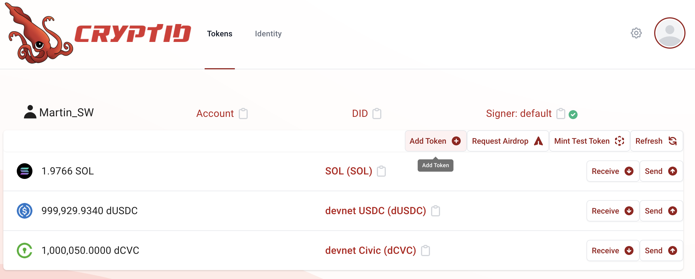
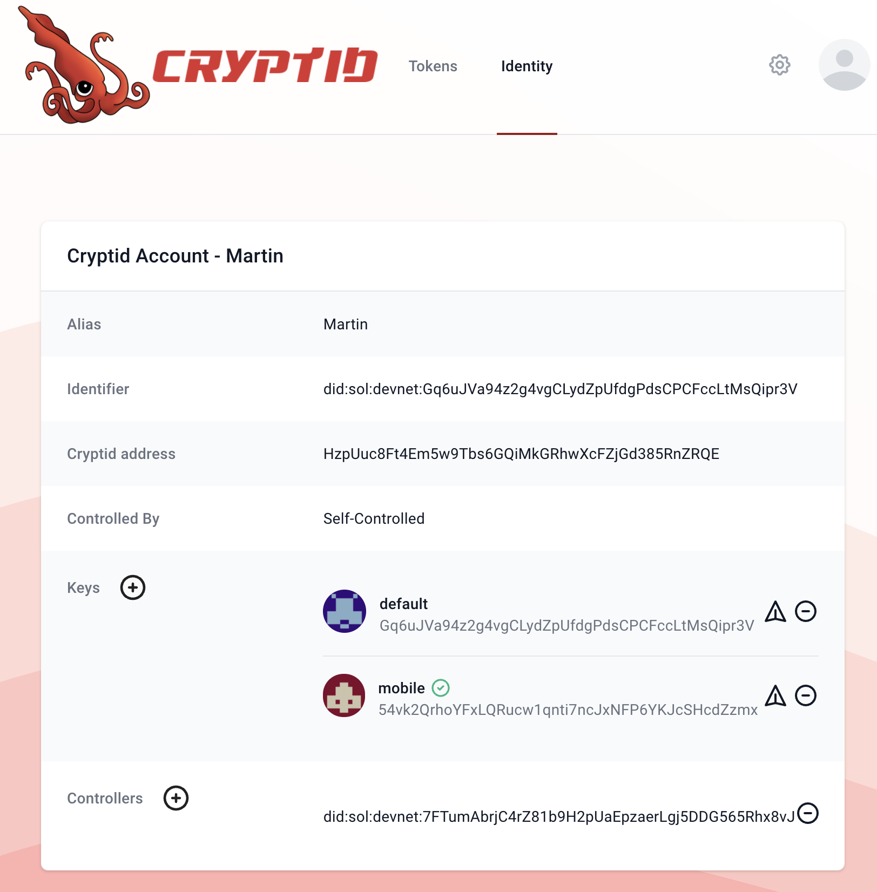

# Cryptid
Cryptid is a protocol and client-suite that brings the power of [DIDs](https://www.w3.org/TR/did-core/) to
[Solana](https://solana.com).

The way to identity yourself on the blockchain at the moment is through ownership of a private key. 
You essentially are your private key. Assets are owned and transactions are signed using this key.

Cryptid provides a basis for an identity layer on the blockchain, specifically on Solana. It does this by providing a 
flexible layer between the user and one or more private keys. Instead of assets being owned and transactions signed by 
a single private key, these assets are now owned and transactions are signed by a Cryptid account.

Try it out at https://cryptid.identity.com/ or install the [cli](./cli/).

## Contents
* [Demo](#demo)
* [Features](#features)
* [On Our Roadmap](#on-our-roadmap)
* [Frequently Asked Questions (FAQs)](#frequently-asked-questions--faqs-)
* [Getting started](#getting-started)
* [Technical Details](#technical-details)

## Demo
### Balances


### ID Overview


## Features

* Create a Cryptid account from your existing Solana wallet
* Access your funds across multiple devices using different keys
* Rotate keys as needed
* Allow other Cryptid accounts to transact on your behalf
* Perform standard Solana transactions

### On Our Roadmap

* Multisig
* Rules and permissions
* Spending limits and control
* Secure and non-custodial standing orders

## Frequently Asked Questions (FAQs)

### What is a Cryptid account?
A Cryptid account is an _identity_ in the form of an individual, company, pet, "inanimate object" or any real world
_thing_ you can think of.

By allowing for multiple keys on a single identity, a Cryptid account can perform actions like:
* Multiple devices accessing the account
* Assigning control of the account to other Cryptid accounts
* Key rotation and account recovery
* Hot and cold storage
* And more...

### How do I create a Cryptid account?
If you have a Solana wallet, you already have a Cryptid account. You can select from an existing supported wallet to
activate your encrypted account, or import your existing keys.

If you don't have an account yet, just follow our on screen instructions to create one.

### How much does a Cryptid account cost?
By default, your Cryptid account is free. Anyone with an existing Solana account already has a Cryptid account they can
start using.

Advanced usage of Cryptid requires additional information to be registered on-chain, which incurs a cost imposed by
Solana. The details of these costs are explained in detail in the 
[Solana documentation](https://docs.solana.com/developing/programming-model/accounts#calculation-of-rent)


<!--


### What is Cryptid?
Cryptid is a protocol and client-suite that brings the power of [DIDs](https://www.w3.org/TR/did-core/) to 
[Solana](https://solana.com). Specifically, it allows for a construct whereby a wallet is owned by a DID, and the DID 
defines the keys that are capable of transacting with that wallet.

### How secure is Cryptid?
All functionality, key generation and blockchain interaction happens directly on the client. No information is stored in
any centralized database outside of your control.

### How decentralized is Cryptid?
Cryptid only requires a [JSON RPC API](https://solana-labs.github.io/solana-web3.js/) endpoint to Solana and all
transactions are executed on the blockchain. Keys are generated and stored on your local environment and never stored
on a centralized database.

### Can I use Cryptid on Mainnet?
The Cryptid Solana program is currently available on Devnet. 

### How do I add an additional key to my DID?
Once your account has been created, click the "Add Key" button under the Keys section. You will need to provide the
public key, and a key name unique to your DID.

### How can I add a controller to my DID?
In the controller section of your account view, click "Add Controller". Enter the DID of the controller you would like
to add.

### How much does it cost to create a DID?
Creating a DID is free. Adding additional keys, services or controllers to the DID will require a transaction and 
incur additional costs as [rent](https://docs.solana.com/developing/programming-model/accounts#rent).
-->

## Getting Started
To contribute to Cryptid, please check out the [code of conduct](./CODE_OF_CONDUCT.md).

---

To build and test locally, first install the prerequisites and dependencies.

1. Install [NVM](https://github.com/nvm-sh/nvm#installing-and-updating) and [Yarn 1.x](https://yarnpkg.com/)
2. Update node:
```sh
nvm install
```
3. Install the dependencies
```
yarn
```

### Program

To build the Rust Solana program, please ensure:
1. You have the Solana tool suite installed locally by following the steps [here](https://docs.solana.com/cli/install-solana-cli-tools).
2. You have the Rust tool suite installed locally by following the steps [here](https://www.rust-lang.org/tools/install)

Once Rust and Solana are installed, build using:
```sh
cargo build-bpf
```

Run the program functional tests using:
```sh
cargo test-bpf
```

### Client

The Cryptid client library provides functionality for signing transactions and managing Cryptid DID wallets. It is 
required by the [CLI](#cli) and [Wallet UI](#wallet-ui).

1. Build the client:
```sh
yarn workspace @identity.com/cryptid build
```

2. Run the unit tests:
```sh
yarn workspace @identity.com/cryptid test
```

3. Run the e2e tests (you must first compile the Cryptid Rust program (see [Program](#program) above):
```shell
yarn workspace @identity.com/cryptid test-e2e
```

### CLI

The cli tool provides utilities for signing transactions and managing Cryptid DID wallets.

1. Run the tests:
```sh
yarn workspace @identity.com/cryptid-cli test
```

2. Run the cli locally:
```sh
yarn workspace @identity.com/cryptid-cli cryptid
```

CLI usage instructions can be found in the [readme](./cli/README.md).

### Wallet

The wallet provides a user interface for signing transactions and managing Cryptid DID wallets.

1. Start the test validator:
```sh
yarn start-validator
```

2. Start the Cryptid wallet:
```sh
yarn workspace @identity.com/cryptid-wallet start
```

# Technical Details
