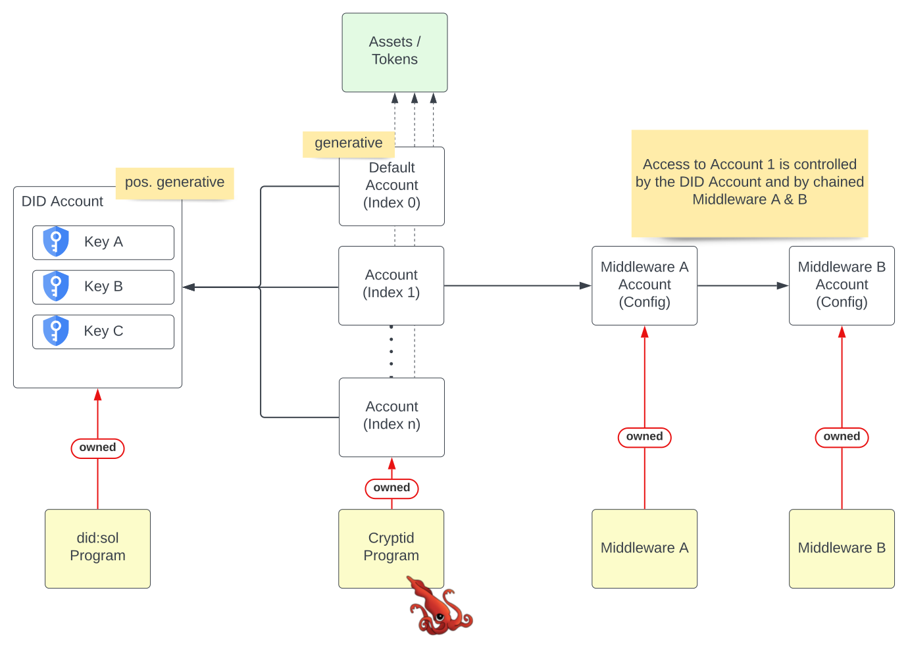

# Cryptid

Cryptid is a protocol and client-suite that brings the power of Identity to
[Solana](https://solana.com).

Traditionally, the way to identify yourself on the blockchain is through ownership of a private key. You essentially are
your private key. Assets are owned and transactions are signed using this key.

Cryptid changes this, by establishing an identity layer on the blockchain, specifically on Solana. It does this by
providing general-purpose, flexible proxy accounts between the user and their private keys. Instead of assets being
owned and transactions being signed by a single private key, these assets are now owned and transactions are signed by a
Cryptid account.

Cryptid is tightly coupled to `did:sol` ([Github](https://github.com/identity-com/sol-did)). A Cryptid account is
controlled either
1. directly by a DID or
2. by a DID and a Middleware Account (that can be generically chained to an arbitary number of Middleware accounts)

Middleware is useful to control access to a Cryptid Account with one or more additional constraints. Middleware programs
are independent, native, or third-party programs that adhere to a predefined program and client interface. For example,
Middlewares could do one of the following:

- Only allow access to the Cryptid Account when an additional permissioned token is present.
- Only allow access to the Cryptid Account after a certain time has elapsed between proposing and executing a transaction
- Only allow access to the Cryptid Account after passing more advanced multi-sig requirements
- ...

Therefore, Cryptid represents a powerful general-purpose implementation of a wallet-abstraction that allows a user to
control access to a Cryptid account in a flexible and extensible way.

## Overview



Like DIDs, Cryptid has a powerful generative feature, where everyone with a DID also, by default, has a Cryptid account
with Index 0. That means, that even without a subject interacting in any way with the chain they have a valid Cryptid
account controlled by their DID. This is a useful transitive property, meaning, everyone with a valid Solana wallet
`XYZ...` also has a generative DID `did:sol:XYZ...` and a generative Cryptid account `ABC...` (as PDA of DID and Index).

Cryptid accounts with higher indexes (> 0) are created explicitly and can (optionally) be configured to also adhere to
Middleware constraints. Middleware accounts can chain other Middleware accounts allowing for composable solutions 
without rewriting any code. This code is often critical to security and so should be not be changed as a best practice. 

## Features

* Create a Cryptid account from your existing Solana wallet
* Access your funds across multiple devices without sharing key material or relying on off-chain infrastructure
* Cryptid allows you to remove a key from the DID if it becomes compromised, ensuring you can keep control of your identity even
  if your wallet is breached. Even your initial wallet key can be removed and replaced with a secure key.
* Interact with dApps
  * Cryptid behaves just like any other wallet
* Through the "controller" feature, Cryptid accounts can be connected together. This allows:
  * fully on-chain and secure trust accounts
  * individuals can control assets belonging to dependents
  * corporate wallets - company executives can share control of a company wallet without sharing keys
* Cryptid accounts can additionally be configured to adhere to Middleware program constraints.
  * Middleware Accounts can be chained in order to reuse Middleware programs in a composable way
  * Middleware programs can be native or third-party

### Self-Sovereign Identities

DIDs ([Decentralized Identifiers](https://www.w3.org/TR/did-core/)) are the standard identifier for self-sovereign identity. It is a globally unique
identifier and independent of any central authority.

Cryptid uses the `did:sol` did method on Solana. The use of DIDs in Cryptid means that it can be tied to verifiable
credentials, and add claims on your Cryptid account.

As an example, we can verify that an NFT creator that has created an NFT under key X is a 
particular artist. We can add a verifiable credential that attests to their identity and have it discoverable on-chain 
(either directly on-chain, or via a link that is discoverable on-chain).

## On Our Roadmap

### M-of-N Multisig
Cryptid currently supports 1-of-N multisig, where only one signer of a set of keys that are allowed to sign is all that is required to complete transactions. We plan to expand this to support threshold-multisig via Middleware. 

M-of-N multi-sig requires a set number `M` from the `N` group of signers to sign each transaction. This would be like having a committtee or board where three people of a group of five must approve a purchase.

### Spending limits and restrictions

An important part of the Cryptid model is the ability to add restrictions to a Cryptid account. We plan to support the
following via Middleware:

* Spending limits
* ~~Recipient whitelists (all fully non-custodial and on-chain)~~ (implemented as native Middleware)

This will allow use-cases such as:

* "savings accounts" protected by cold-storage keys, with a "current account" balance on a hot wallet, all under the
  same account
* non-custodial account recovery, either social or via a third-party
* subscriptions - secure and non-custodial standing orders for periodic payments on-chain.

## Frequently Asked Questions (FAQs)

### What is a Cryptid account?

A Cryptid account is an _identity_ in the form of an individual, company, pet, "inanimate object" or any real world
_thing_ you can think of.

Cryptid account can have zero or more keys associated with it. Accounts with zero keys can be controlled by a separate
entity. Accounts with multiple keys will allow a Cryptid account to perform actions like: 

* Multiple devices accessing the account
* Key rotation and account recovery
* Hot and cold storage

### How do I create a Cryptid account?

All existing Solana wallets are automatically compatible with Cryptid. If you have a wallet, you have a Cryptid account
automatically. Your default Cryptid account has a new address, but is backed by your existing wallet, and
transactions you make with it are signed with your existing wallet key.

### How much does a Cryptid account cost?

By default, a Cryptid account is free. Anyone with an existing Solana account already has a Cryptid account they can
start using.

Advanced usage of Cryptid requires additional information to be registered on-chain, which incurs a cost imposed by
Solana. The details of these costs are explained in detail in the
[Solana documentation](https://docs.solana.com/developing/programming-model/accounts#calculation-of-rent)

### Do dApps need a special integration to use Crytpid?

No! We are planning to include Cryptid as a supported wallet within 
[Solana's Wallet Standard](https://github.com/solana-labs/wallet-standard) which would make the utilization of Cryptid 
completely transparent towards the dApp. It's just one more option for the user to chose from.

### Who really owns the funds in my Cryptid address?

On-chain, your Cryptid address is owned by the System Program however the 
[Cryptid Signer program](./programs/cryptid) is the authority for it, which makes sure that only keys and/or 
controllers in your Cryptid account are able to sign for it. Therefore, if the program is secure, your funds are too.

Before launching Cryptid on Mainnet we will go through an extensive audit process, so that you don't only need to take
our word for it!

Lastly, since Solana generally allows programs to be updated, there would be a potential attack vector there. We will make
sure that the Cryptid program is either (1) not upgradable or (2) in the complete control of a multi-sig DAO structure.
The latter would even be able to support account recoveries via the DAO. 

### Why does the world need Cryptid?

We understand that direct private key ownership is the ultimate level of control for any address or program on a blockchain. 
However, we envision the future world of web3 much more nuanced than this! Private Key ownership is absolute, either you
have it or you don't. With this restriction, all higher level access mechanism are pushed off-chain into a world of
centralized services like custodial wallets or exchanges.

In contrast, we would like to see all these [current](#features) and [future](#on-our-roadmap) features realized on-chain
where everyone can transparently see and verify them.

## Getting Started

To contribute to Cryptid, please check out the [code of conduct](./CODE_OF_CONDUCT.md).

---

To build and test locally, first install the prerequisites and dependencies.

1. Install [NVM](https://github.com/nvm-sh/nvm#installing-and-updating) and [Yarn 1.x](https://yarnpkg.com/)
2. Update node:

```sh
nvm install
```

3. Install the dependencies

```
yarn
```

### Program

To build the Rust Solana program, please ensure:

1. You have the Solana tool suite installed locally by following the
   steps [here](https://docs.solana.com/cli/install-solana-cli-tools).
2. You have the Rust tool suite installed locally by following the steps [here](https://www.rust-lang.org/tools/install)
3. You have the Anchor framework installed locally by following the steps [here](https://www.anchor-lang.com/docs/installation)

Once Rust, Solana, and Anchor are installed, build using:

```sh
anchor build
```

Run the program functional tests using:

```sh
anchor test
```

### Client and CLI

The Cryptid client library provides functionality for signing transactions and managing Cryptid DID wallets. 

Build all client related backages (automatically also builds the program):

```sh
yarn build
```

CLI usage instructions can be found in the [readme](./packages/client/cli/README.md).


# Technical Details

Cryptid uses meta-transactions to abstract the key from the identity. Transactions signed by a Cryptid account are, in
fact, wrapped in a meta-transaction. The meta-transaction is signed by a private key and then sent to
the [Cryptid program](./programs/cryptid)
The Cryptid program validates that the private key has the permissions to sign the transaction from the Cryptid account,
according to the associated identity stored on chain.

The identity information is represented as a DID, using the `did:sol` program. It associates an identity with:

* a set of rotatable keys
* a set of permissions on those keys
* a set of controllers

## Signing permissions

A key is permitted to sign a transaction from a Cryptid account if:

It is listed on the DID as a `capabilityInvocation` key

OR

It is permitted to sign on one of the controllers of the DID. Controllers of DIDs are themselves DIDs, and the
controller relationship is transitive. So a controller of a DID can sign transactions for that DID or any DIDs controlled by that DID.

## Meta-Transactions

The initial instructions in a transaction are serialised and added as data to the Cryptid transaction. This
serialization adds some overhead to the transaction size, meaning that some transactions that initially fit within the
transaction size limit might now exceed it. On the roadmap are plans to allow transactions to be chunked to avoid this
limitation.
