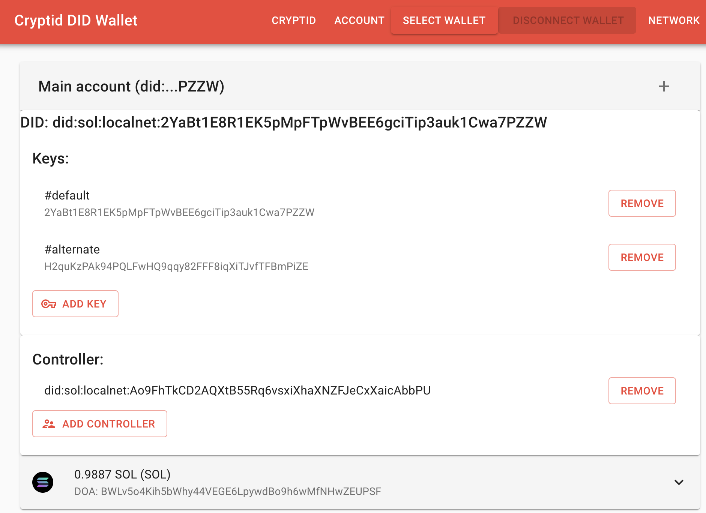

# Cryptid
Cryptid is a protocol and client-suite that brings the power of Identity to
[Solana](https://solana.com).

The way to identity yourself on the blockchain at the moment is through ownership of a private key. 
You essentially are your private key. Assets are owned and transactions are signed using this key.

Cryptid changes this, by establishing an identity layer on the blockchain, specifically on Solana. It does this by 
providing a general-purpose, flexible proxy account between the user and their private keys. Instead of assets being 
owned and transactions signed by a single private key, these assets are now owned and transactions are signed by a 
Cryptid account.

Try it out at https://cryptid.identity.com/ or install the [cli](./cli/).

## Contents
* [Demo](#demo)
* [Features](#features)
* [On Our Roadmap](#on-our-roadmap)
* [Frequently Asked Questions (FAQs)](#frequently-asked-questions--faqs-)
* [Getting started](#getting-started)
* [Technical Details](#technical-details)

## Demo


## Features

* Create a Cryptid account from your existing Solana wallet
* Access your funds across multiple devices using different keys
* Rotate keys as needed
* Grant permissions to other Cryptid accounts to transact on your behalf
* Perform standard Solana transactions
* Through the "controller" feature, Cryptid accounts can be connected together. This allows
  * fully on-chain and secure trust accounts
  * individuals can control assets belonging to dependents
  * corporate wallets - company executives can share control of a company wallet without sharing keys

### On Our Roadmap

* Multisig
* Rules and permissions
* Spending limits and control
* Secure and non-custodial standing orders

## Frequently Asked Questions (FAQs)

### What is a Cryptid account?
A Cryptid account is an _identity_ in the form of an individual, company, pet, "inanimate object" or any real world
_thing_ you can think of.

By allowing for multiple keys on a single identity, a Cryptid account can perform actions like:
* Multiple devices accessing the account
* Key rotation and account recovery
* Hot and cold storage
* And more...

### How do I create a Cryptid account?
If you have a Solana wallet, you already have a Cryptid account. You can select from an existing supported wallet to
activate your encrypted account, or import your existing keys.

If you don't have an account yet, just follow our on screen instructions to create one.

### How much does a Cryptid account cost?
By default, your Cryptid account is free. Anyone with an existing Solana account already has a Cryptid account they can
start using.

Advanced usage of Cryptid requires additional information to be registered on-chain, which incurs a cost imposed by
Solana. The details of these costs are explained in detail in the 
[Solana documentation](https://docs.solana.com/developing/programming-model/accounts#calculation-of-rent)


## Getting Started
To contribute to Cryptid, please check out the [code of conduct](./CODE_OF_CONDUCT.md).

---

To build and test locally, first install the prerequisites and dependencies.

1. Install [NVM](https://github.com/nvm-sh/nvm#installing-and-updating) and [Yarn 1.x](https://yarnpkg.com/)
2. Update node:
```sh
nvm install
```
3. Install the dependencies
```
yarn
```

### Program

To build the Rust Solana program, please ensure:
1. You have the Solana tool suite installed locally by following the steps [here](https://docs.solana.com/cli/install-solana-cli-tools).
2. You have the Rust tool suite installed locally by following the steps [here](https://www.rust-lang.org/tools/install)

Once Rust and Solana are installed, build using:
```sh
cargo build-bpf
```

Run the program functional tests using:
```sh
cargo test-bpf
```

### Client

The Cryptid client library provides functionality for signing transactions and managing Cryptid DID wallets. It is 
required by the [CLI](#cli) and [Wallet UI](#wallet-ui).

1. Build the client:
```sh
yarn workspace @identity.com/cryptid build
```

2. Run the unit tests:
```sh
yarn workspace @identity.com/cryptid test
```

3. Run the e2e tests (you must first compile the Cryptid Rust program (see [Program](#program) above):
```shell
yarn workspace @identity.com/cryptid test-e2e
```

### CLI

The cli tool provides utilities for signing transactions and managing Cryptid DID wallets.

1. Run the tests:
```sh
yarn workspace @identity.com/cryptid-cli test
```

2. Run the cli locally:
```sh
yarn workspace @identity.com/cryptid-cli cryptid
```

CLI usage instructions can be found in the [readme](./cli/README.md).

### Wallet

The wallet provides a user interface for signing transactions and managing Cryptid DID wallets.

1. Start the test validator:
```sh
yarn start-validator
```

2. Start the Cryptid wallet:
```sh
yarn workspace @identity.com/cryptid-wallet start
```

# Technical Details
Cryptid uses meta-transactions to abstract the key from the identity.
Transactions signed by a cryptid account are, in fact, wrapped in a meta transaction.
The meta-transaction is signed by a private key and then sent to the [Cryptid program](./programs/cryptid_signer)
The Cryptid program validates that the private key has the permissions to sign the transaction from the Cryptid account,
according to the associated identity stored on chain.

The identity information is represented as a DID, using the SOL-DID program. It associates an identity with
* a set of rotatable keys
* a set of permissions on those keys
* a set of controllers

## Signing permissions
A key is permitted to sign a transaction from a Cryptid account if:

It is listed on the DID as a "capabilityInvocation" key

OR

It is permitted to sign on one of the controllers of the DID. Controllers of DIDs are themselves DIDs, and
the controller relationship is transitive. So a controller of a DID may sign transactions for that DID, or any DIDs 
that it, in turn, controls.

## Meta-Transactions
The initial instructions in a transaction are serialised and added as data to the Cryptid transaction.
This serialisation adds some overhead to the transaction size, meaning that some transactions that initially fit within 
the transaction size limit may now exceed it. On the roadmap are plans to allow transactions to be chunked to avoid this
limitation.
